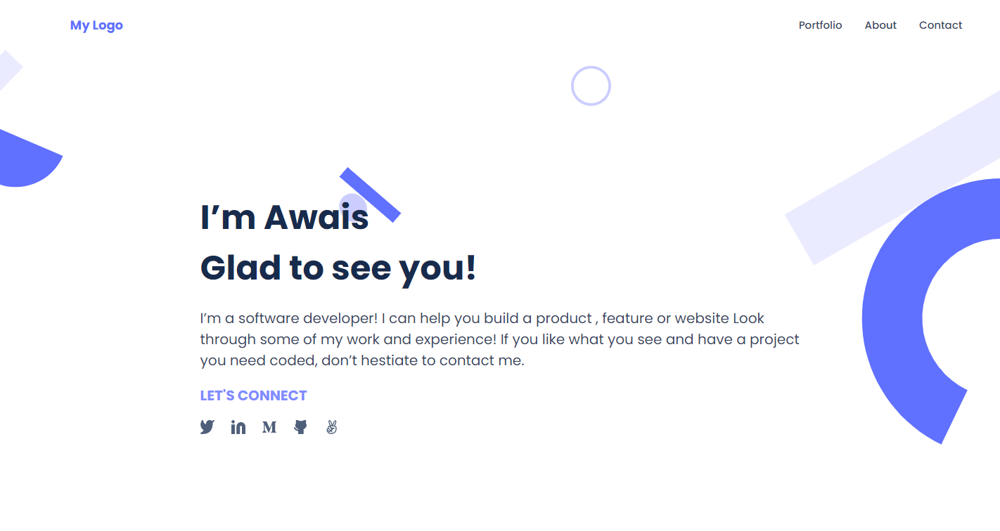

# Portfolio

> My Professional Portfolio.

This website describes my Professional Experience, Achievements and Personal Projects.

## Built With

- HTML & CSS

## Live Demo

[Live Demo Link](https://awais-amjed.github.io/Portfolio/)

## Getting Started

To get a local copy up and running follow these simple example steps.

### Prerequisites

A Web Browser (preferably Google Chrome)

### Setup

Clone the GitHub Repository

### Usage

Open index.html in Chrome

## Authors

👤 **Author1**

- GitHub: [Awais Amjed](https://github.com/awais-amjed)
- Website: [Coding Fries](https://codingfries.com)
- LinkedIn: [LinkedIn](https://www.linkedin.com/in/awais-amjed)

## 🤝 Contributing

Contributions, issues, and feature requests are welcome!

Feel free to check the [issues page](../../issues/).

## Show your support

Give a ⭐️ if you like this project!

## Acknowledgments

- Microverse
